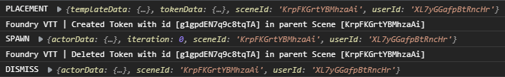

# Warp Gate

**Reinforcements have arrived**

Warp Gate, in its current form, is a system-agnostic library module for Foundry VTT that provides a growing number of API functions to make programmatically spawning tokens and modifying those tokens easier for players and GMs alike.

https://user-images.githubusercontent.com/14878515/127940403-40301919-8a12-42e0-b3c4-7711f6e64b3b.mp4

Be sure to check out the [Warp Gate Wiki](https://github.com/trioderegion/warpgate/wiki) for specific examples and further discussion!

## Table of Contents

	Click to expand

	
- [Spawning Commands](#spawning-commands)
  - [spawn](#spawn)
  - [spawnAt](#spawnat)
- [Spawn Callback Functions](#spawn-callback-functions)
  - [pre](#pre)
  - [post](#post)
- [Mutation Commands](#mutation-commands)
  - [mutate](#mutate)
  - [revert](#revert)
- [Mutation Callback Functions](#mutation-callback-functions)
  - [delta](#delta)
  - [post](#post)
- [Crosshairs Commands](#crosshairs-commands)
  - [show](#show)
  - [getTag](#gettag)
  - [collect](#collect)
- [Crosshairs Config](#crosshairs-config)
- [Crosshairs Callback Functions](#crosshairs-callback-functions)
- [Helper Functions](#helper-functions)
  - [wait](#wait)
  - [dismiss](#dismiss)
  - [buttonDialog](#buttondialog)
  - [dialog](#dialog)
- [Update Shorthand](#update-shorthand)
  - [Add](#add)
  - [Update](#update)
  - [Delete](#delete)
  - [embedded Structure](#embedded-structure)
- [Event System](#event-system)
  - [watch](#watch)
  - [trigger](#trigger)
  - [remove](#remove)
  - [notify](#notify)
  - [eventData](#eventdata)
    - [actorData](#actordata)
- [Special Thanks](#special-thanks)
	

## Spawning Commands

### spawn
Signature: `async warpgate.spawn(actorName, updates = {}, callbacks = {}, options = {})`

The primary function of Warp Gate. When executed, it will create a custom MeasuredTemplate that is used to place the spawned token and handle any customizations provided in the `updates` object. `warpgate#spawn` will return a Promise that can be awaited, which can be used in loops to spawn multiple tokens, one after another. The player spawning the token will also be given Owner permissions for that specific token actor. This means that players can spawn any creature available in the world.
 * actorName {String}: Name of actor to spawn
 * updates {Object} Updates to the spawned actor (optional). See [Update Shorthand](#update-shorthand).
 * callbacks {Object} Callback functions (optional). See [Spawn Callback Functions](#spawn-callback-functions) and [Crosshairs Callback Functions](#crosshairs-callback-functions).
 * options {Object} Options (optional) 
 	- `controllingActor` {Actor} will minimize this actor's open sheet (if any) for a clearer view of the canvas during placement. Also flags the created token with this actor's id. Default `null`.
  - `duplcates` {Number} will spawn multiple tokens from a single placement. See also `collision`. Default `1`.
  - `collision` {Boolean} controls whether the placement of a token collides with any other token or wall and finds a nearby unobstructed point (via a radial search) to place the token. If `duplicates` is greater than 1, default is `true`; otherwise `false`.
  - `comparisonKeys` {Object}. string-string key-value pairs indicating which field to use for comparisons for each needed embeddedDocument type. Ex. From dnd5e: {'ActiveEffect' : 'data.label'}
  - `crosshairs` {Object}. A crosshairs configuration object to be used for this spawning process

`return value` {Array<Strings>} IDs of all created tokens

### spawnAt

Signature: `async warpgate.spawnAt(location, tokenData, updates, callbacks, options)`

An alternate, more module friendly spawning function. Will create a token from the provided token data and updates at the designated location. 
* `location` {Object} of the form {x: Number, y: Number} designating the token's _center point_
* `tokenData` {TokenData} the base token data from which to spawn a new token and apply updates to it.
* `updates`, `callsbacks`, `options`, and `return value`: See [`warpgate.spawn`](#spawn).

## Spawn Callback Functions

The `callbacks` object as used by `spawn` and `spawnAt` has two expected keys: `pre` and `post` and provide a way to execute custom code during the spawning process. Both key values are type `async function`.  Below are the function signatures expected and all arguments are optional. If the callback function modifies `updates` or `location`, it is often best to do this via `mergeObject` due to pass by reference restrictions.

### pre

Expected signature: `async pre(location, updates)`

Executed after placement has been decided, but before updates have been issued or tokens spawned. Used for modifying the updates based on position of the placement.
 * `location` {Object} of the form {x: Number, y: Number} designating the token's _center point_
 * `updates` {Object} The update object passed into `warpgate#spawn`.

 * `return value` {Promise}

### post

Expected signature: `async post(location, spawnedTokenDoc, updates, iteration)`

Executed after the token has been spawned and any updates applied. Good for animation triggers, or chat messages. Additionally, when utilizing the `duplicates` option, the update object used to spawn the next token is passed in for modification for the indicated iteration. Note, the same update object is used throughout the spawning process, being modified as desired on each iteration.
 * `location` {Object} of the form {x: Number, y: Number} designating the token's _center point_
 * `spawnedTokenDoc` {TokenDocument} The token spawned by this iteration.
 * `updates` {Object} The update object from the just spawned token. Will be applied to default prototoken data for next iteration
 * `iteration` {Number} The iteration index of the _next_ iteration. 0-indexed.
 
 * `return value` {Promise}
	
## Mutation Commands

### mutate

Signature: `async warpgate.mutate(tokenDoc, updates = {}, callbacks = {}, options = {})`
   
Given an update argument identical to `warpgate.spawn` and a token document, will apply the changes listed in the updates and (by default) store the change delta, which allows these updates to be reverted.  Mutating the same token multiple times will "stack" the delta changes, allowing the user to remove them one-by-one in opposite order of application (last in, first out).

 * `tokenDoc` {TokenDocument}: Token document to update, does not accept Token Placeable.
 * `updates` {Object = {}}: As `warpgate.spawn`.
 * `callbacks` {Object = {}}. Two provided callback locations: `delta` and `post`. Both are awaited.
  - `delta` {Function(delta, tokenDoc)} Called after the update delta has been generated, but before it is stored on the actor. Can be used to modify this delta for storage (ex. Current and Max HP are increased by 10, but when reverted, you want to keep the extra Current HP applied. Update the delta object with the desired HP to return to after revert, or remove it entirely.
    - `delta` {Object}: Computed change of the actor based on `updates`.
    - `tokenDoc` {TokenDocument}: Token being modified.
 - `post` {Function(tokenDoc, updates)} Called after the actor has been mutated and after the mutate event has triggered. Useful for animations or changes that should not be tracked by the mutation system.
   - `tokenDoc` {TokenDocument}: Token that has been modified.
   - `updates` {Object}: See parent `updates` parameter.
 * `options` {Object = {}}
   - `comparisonKeys`: {Object = {}}. string-string key-value pairs indicating which field to use for comparisons for each needed embeddedDocument type. Ex. From dnd5e: `{'ActiveEffect' : 'label'}` will tell warpgate that its key, "Rage", should be checked against the `ActiveEffect#data.label` field rather than the default `Document#name` field.
   - `permanent`: {Boolean = false}. Indicates if this should be treated as a permanent change to the actor, which does not store the update delta information required to revert mutation.
   - `name`: {String = randomId()}. User provided name, or identifier, for this particular mutation operation. Used for 'named revert'.

`return value` {Promise\<Object\>} The mutation information produced by the provided updates, if they are tracked (i.e. not permanent). Includes the mutation name, which is particularly useful if no name was provided and a random ID is generated.
 
### revert

Signature: `async warpgate.revert(tokenDoc, mutationName = undefined)`

Removes the latest mutation applied to the provided token's actor. Using the default parameters behaves as the "revert" header button on the character sheet does. Note: Shift-clicking on the revert header button will present a button dialog from which specific mutations can be reverted.
 * `tokenDoc` {TokenDocument}: Token document to update, does not accept Token Placeable.
 * `mutationName` {String = undefined}: Specific mutation to revert from the provided token.
 
 * `return value` {Promise\<Object\>}: The update object applied to the actor to revert the mutation operation.

## Mutation Callback Functions

The `callbacks` object as used by `mutate` has two expected keys: `delta` and `post`. Both are awaited.
  
### delta

Expected signature: `async delta(delta, tokenDoc)` 

Called after the update delta has been generated, but before it is stored on the actor. Can be used to modify this delta for storage. For example, current and Max HP are increased by 10, but when reverted, you want to keep the extra Current HP applied. Update the delta object with the desired HP to return to after revert, or remove it entirely.
 * `delta` {Object}: Computed change of the actor based on `updates`.
 * `tokenDoc` {TokenDocument}: Token being modified.

 * `return value` {Promise}

### post

Expected signature: `async post(tokenDoc, updates)` 

Called after the actor has been mutated and after the mutate event has triggered. Useful for animations or changes that should not be tracked by the mutation system.
 * `tokenDoc` {TokenDocument}: Token that has been modified.
 * `updates` {Object}: See parent `updates` parameter.

 * `return value` {Promise}

## Crosshairs Commands

### show

Signature: `async warpgate.crosshairs.show(config = {}, callbacks = {})`

Creates a circular template attached to the cursor. Its size is in grid squares/hexes and can be scaled up and down via shift+mouse scroll. Resulting data indicates the final position and size of the template. Note: Shift+Scroll will increase/decrease the size of the crosshairs outline, which increases or decreases the size of the token spawned, independent of other modifications.
* `config` {Object} Configuration settings for how the crosshairs template should be displayed. See [Crosshairs Config](#crosshairs-config).
* `callbacks` {Object} Functions executed at certain stages of the crosshair display process. See [Crosshairs Callback Functions](#crosshairs-callback-functions)

`return value` {Object} Contains all of the fields as MeasuredTemplateData with the following changes
* `width` {Number} the final size of the template's diamater in grid squares.
* `cancelled` {Boolean} if the user cancelled creation via right click.

### getTag

Signature: `warpgate.crosshairs.getTag(key)`

Will retrieve the active crosshairs instance with the defined tag identifier.
* `key` {\*} Will be compared against the Crosshairs `tag` field for equality.

`return value` {Crosshairs} Active Crosshairs matching the given key or `undefined` if no match
	
### collect

Signature: `warpgate.crosshairs.collect(crosshairsData, types, containedFilter = Gateway._containsCenter)`

Returns desired types of placeables whose center point is within the crosshairs radius or another user defined filter function.
                                                                                                        
* `crosshairsData` {Object}. Requires at least {x,y,radius,scene} (all in pixels)
* `types` {Array<String> = `['Token']`} Collects the desired embedded placeable types.
* `containedFilter` {Function = `Gateway._containsCenter`}. Optional function for determining if a placeable is contained by the crosshairs. Default function tests for centerpoint containment. Expected signature `Boolean function(placeable, crosshairsData)`: given a Placeable object and the crosshairs data, return a boolean indicating if the placeable should be counted as contained with the crosshair's area. 
                                                                                                        
`return` {Object<embeddedName: collected>} List of collected placeables keyed by embeddedName

## Crosshairs Config

This object controls how the crosshairs will be displayed and decorated. Each field is optional and the default value is listed in parentheses.

* `size` {Number = `1`} The initial diameter of the crosshairs outline in grid squares
* `icon` {String = `'icons/svg/dice-target.svg'`} The icon displayed in the center of the crosshairs
* `label` {String = `''`} The text to display below the crosshairs outline
* `labelOffset` {Object} Pixel offset from the label's initial relative position below the outline
  * `x` {Number = `0`}
  * `y` {Number = `0`}
* `tag` {\*}(`'crosshairs'`) Arbitrary value used to identify this crosshairs object
* `drawIcon` {Boolean = `true`} Controls the display of the center icon of the crosshairs
* `drawOutline` {Boolean = `true`} Controls the display of the outline circle of the crosshairs
* `interval` {Number = `2`} Sub-grid granularity per square. Snap points will be created every 1/`interval` grid spaces. Positive values begin snapping at grid intersections. Negative values begin snapping at the center of the square. Ex. the default value of 2 produces two snap points -- one at the edge and one at the center; `interval` of 1 will snap to grid intersections; `interval` of -1 will snap to grid centers.
* `fillAlpha` {Number = `0`} Alpha (opacity) of the template's fill color (if any).
* `fillColor` {String = `game.user.color`} Color of the template's fill when no texture is used.
* `texture` {String = null} Asset path of the texture to draw inside the crosshairs border.
* `tileTexture` {Boolean = false} Indicates if the texture is tileable and does not need specific offset/scaling to be drawn correctly. By default, the chosen texture will be position and scaled such that the center of the texture image resides at the center of the crosshairs template.
* `lockSize` {Boolean = true} Controls the ability of the user to scale the size of the crosshairs using shift+scroll. When locked, shift+scroll acts as a "coarse rotation" step for rotating the center icon.

## Crosshairs Callback Functions

The `callbacks` object, as used by `show`, has one expected key: `show`

### show

Expected signature: `await show(crosshairs)`

Called after the crosshairs have be drawn and listeners activate. This function is not awaited

* `crosshairs` {Crosshairs} The current crosshairs template that has just been drawn. Derived from MeasuredTemplate and can be modified to alter the appears of the crosshairs itself. All of the fields in the [Crosshairs Config](#crosshairs-config) object can be modified directly. Any fields owned by MeasuredTemplate must be changed via `crosshairs.update` as other DocumentData classes. Async functions will run in parallel while the user is moving the crosshairs. Serial functions will block detection of the left and right click operations until return.

## Helper Functions

### wait

Signature: `async warpgate.wait(timeMs)`

Helper function. Waits for a specified amount of time in milliseconds (be sure to await!). Useful for timings with animations in the pre/post callbacks.

### dismiss

Signature: `async warpgate.dismiss(tokenId, sceneId)`

Deletes the specified token from the specified scene. This function allows anyone to delete any specified token unless this functionality is restricted to only owned tokens in Warp Gate's module settings. This is the same function called by the "Dismiss" header button on owned actor sheets.

### buttonDialog

Signature: `async warpgate.buttonDialog(data, direction = 'row')`

Helper function for quickly creating a simple dialog with labeled buttons and associated data. Useful for allowing a choice of actors to spawn prior to `warpgate.spawn`.
* `data` {Objects}: Standard dialog keys apart from the contents of `data.buttons`, which is an array of objects containing two keys `label` and `value`. Label corresponds to the button's text. Value corresponds to the return value if this button is pressed. Ex. `{buttons: [{label: 'First Choice', value: {token: {name: 'First'}}}, {label: 'Second Choice', value: {token: {name: 'Second'}}}]}`
* `direction` {String} (optional): `'column'` or `'row'` accepted. Controls layout direction of dialog.

### dialog

Signature: `async warpgate.dialog(data, title = 'Prompt', submitLabel = 'Ok')`

Helper function for creating a more advanced dialog prompt. Can contain many different types of inputs as well as headers and informational text.
`data` {Array of Objects}: Contains the dialog data. Each Object requires the following keys `{type, label, options}`.
* `type` {String} : See table below.
* `label` {String}: the displayed text for this input. Accepts HTML.
* `options` {Array of Strings} or {String}: See table below.

`return value` {Array of *}: Length and order mirrors the input `data` array. The type of the elements is shown on the table below.

| `type` | `options` | `ret val` | notes |
|--|--|--|--|
| button | none | undefined | Ignored entirely (use `buttonDialog`). |
| header | none | undefined | Shortcut for `info | <h2>text</h2>`. |
| info   | none | undefined | Inserts a line of text for display/informational purposes. |
| text | default value | {String} final value of text field | |
| password | (as `text`) | (as `text`) | Characters are obscured for security. |
| radio | group name | selected: {String} `label`. un-selected: {Boolean} `false` | For a given group name, only one radio button can be selected. |
| checkbox | none | {Boolean} `true`/`false` checked/unchecked | Can use options as `radio` type, which assigns the input's `name` property for external interfacing |
| number | (as `text`) | {Number} final value of text field converted to a number |
| select | array of option labels | {String} label of choice | | 

## Update Shorthand
The `update` object can contain up to three keys: `token`, `actor`, and `embedded`. The `token` and `actor` key values are standard update objects as one would use in `Actor#update` and `Token#update`.  The `embedded` key uses a shorthand notation to make creating the updates for embedded documents (such as items) easier. Notably, it does not require the `_id` field to be part of the update object for a given embedded document type.  There are three operations that this object controls -- adding, updating, deleting (in that order).

Note: As of 1.7.0, the `item` field of the update object has been deprecated. Instead, place the value of the item field at `update.embedded.Item`. Support for this field will be removed in 1.9.0.

### Add
Given a key of a **non-existing** embedded document, the value contains the data object for document creation compatible with `createEmbeddedDocuments`. This object can be constructed in-place by hand, or gotten from a template document and modified using `"Item To Add": game.items.getName("Name of Item").data`. As an example. Note: the name contained in the key will override the `name` field in any provided creation data.

### Update
Given a key of an existing document, the value contains the data object compatible with `updateEmbeddedDocuments`

### Delete
Assigning the key to the special constant `warpgate.CONST.DELETE` will remove this document (if it exists) from the spawned actor. e.g.
`{"Item Name To Delete": warpgate.CONST.DELETE}`

### `embedded` Structure
The `embedded` field expects an object with keys corresponding to a embedded document type. Each value for these keys contains an object keyed by "comparison names". Each value for the comparison name keys is an object compatible with the desired add, update, or delete operation.
`{ Embedded Name : { Comparison Name : Update Object, Next Comparison Name : Update Object, etc...} }`

## Event System
Warp Gate includes a hook-like event system that can be used to respond to stages of the spawning and dismissal process. Additionally, the event notify function is exposed so that users and module authors can create custom events in any context.

The console log below shows the order of the built-in Warp Gate events as they related to spawning and dismissing a token:

### watch

Signature: `warpgate.event.watch(eventName, function, conditionFn = () => { return true; })`

Similar in operation to `Hooks.on`, with two exceptions. First, the provided function can be asynchronous and will be awaited. Second, an optional `conditionFn` parameter is added to help comparmentalize logic between detecting the desired event and responding to said event.
 * `eventName` {String} Event name to watch for; It is recommended to use the enums found in `warpgate.EVENT`.
 * `function` {async Function(eventData)} Function to execute when this event has passed the condition function. Will be awaited
 * `conditionFn` {Function(eventData)} Optional. Function to determine if the primary function should be executed.

 * `return value` {Number} Function id assigned to this event.

### trigger

`warpgate.event.trigger(eventName, function, conditionFn)`

Identical to `watch`, except that this function will only be called once, when the condition is met.
 * `eventName` {String} Event name on which to trigger; It is recommended to use the enums found in `warpgate.EVENT`.
 * `function` {async Function(eventData)} Function to execute when this event has passed the condition function. Will be awaited.
 * `conditionFn` {Function(eventData)} Optional. Determine if the primary function should be executed.

 * `return value` {Number} Function id assigned to this event.

### remove 

Signature: `warpgate.event.remove(functionId)`

Removes a `watch` or `trigger` by its provided id -- obtained by the return value of `watch` and `trigger`.
 * `functionId` {Number} Id of function to remove.

 * `return value` {Boolean} Indicates if a function was successfully found and removed.

### notify

Signature: `async warpgate.event.notify(eventName, eventData, onBehalf = game.user.id)`

Allow custom events to be fired using the Warp Gate event system. Is broadcast to all users, including the initiator.
 * eventName {String} Name of this event. Watches and triggers use this name to register themselves.
 * eventData {Object} The data that will be provided to watches and triggers and their condition functions.
 * onBehalf {String} User ID that will be used in place of the current user in the cases of a relayed request to the GM (e.g. dismissal).

 * `return value` {Promise} The client that initiated this event can optionally wait for the event's _local_ execution to finish before moving on.

### eventData
The following table describes the stock events that occur within warpgate. All event names are contained within `warpgate.EVENT`

| Event | Data | Timing | Notes |
| -- | -- | -- | -- |
| <common> | {sceneId, userId} | | userId is the initiator |
| PLACEMENT | {templateData, tokenData} | After placement has been decided | The MeasuredTemplate data used to spawn the token, and the final token data that will be spawned. There is no actor data provided.  |
| SPAWN | {actorData, iteration} | After each token has been created | Iteration this actor was spawned on. See **actorData**, below. |
| DISMISS | {actorData} | After any token is dismissed via `warpgate.dismiss` | see **actorData**, below |
| MUTATE | {actorData, updates} | After a token has been mutated, but before the initiating client has run its post mutate callback | see **actorData**, below. |
| REVERT | {actorData, updates} | After a token has been fully reverted to its previous state | updates are the changes that are applied to the provided actorData (see below) to produce the final reverted state. |

#### actorData
This object is a customized version of `Actor#toObject` with the following change:
 * `token` now contains the final token data, including position. Equivalent to `Token#toObject` with its `actorData` field removed (as it is redundant).

## Special Thanks
* siliconsaint for the inspiration to turn a set of absurd macros into something usable and constantly pushing the envelope.
* LorduFreeman for the pre and post callbacks and immediately using it for beautiful things.
* Wasp for pushing me to make Crosshairs more full featured
